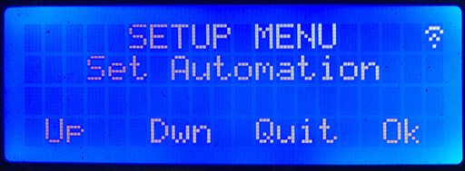
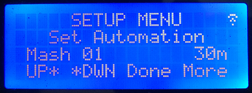
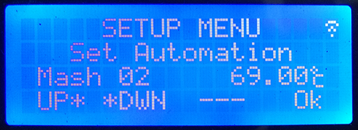
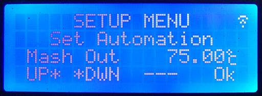
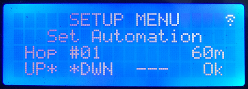

# 4. Brew with Automatic mode

Automation is the heart of BrewManiacEx controller. The brew process starts from heating strike water to optional whirlpool and cooling. It prompts for user interactions, including:

-Malt In

-Malt Out

-Iodine test

-Hop throwing

## 4.1 Setup Automation

Before starting automation, the mash schedule, boil time, and hop time need to be specified. To edit the automation procedure, enter "Setup" then select “Automation”.

The first item to edit  is the temperature of "Mash In", or the temperature of the strike water.

Then, specify the first mash step temperature:

and, the rest time.

After entering the time by **Up/Down** buttons, press "**Done**"(Start button) if this is the final mash step(rest), or “**More**”(Enter button) if more rests are needed.

Repeat the input of temperature and time until all steps are input or the maximum 6 steps are input. 

Then mashout temp and time:

Input number of hops, **Boil Time, **and the time of each hop.

The automation settings are saved. Therefore, if the same recipe is brewed, it is not necessary to setup again.

HopStand editing:

A HopStand Session is a span of temperature range. Maximum number of sessions is 5.

The "start" of hop stand. For FlameOut(KnockOff) hopping, set this number to greater or equal to boiling point. After boiling, when the temperature drops to this value, the controller will alarm to prompt for hop dropping and start counting time.

The minimu temperature of this hopstand session. If the temperature drops below this setting before the specified hop time expires, the heating will be kicked start. If using of heating element is not desired, set this value to a lower value. However, the "start" temperature of next session should be lower than previous “keep” temperature. If precise and specific temperature is desired, set the start and keep temperature to exact the same value.

Set the time of PostBoilHop #01. The first hop in the hopstand session defines the time of the hop stand. Press "Done" if no more hop, “More” else.

Repeat editing HopStand Session and PostBoilHop time until finished.

## 4.2 Running Automation

The automation will run through the brew process that is specified by the automation setup. When user interaction is needed, it will alert the user.

During automated processes, like mashing and boil, additional control is possible. For example, the mash step can be skipped, and the pump can be controlled manually during mashing and boiling.

Automatic Brewing Screens:

* Delay Start

If "Disable Delay Start" is set to “NO”, you will have the option to delay-start the brew. 

* Edit Delay Start Time

Use Up/Down to change the delay time. 15min a step.

* Delay Start Waiting

The brew process will begin after the time counts to zero. 

Go: start immediately.

Quit: quit the brew.

* Mashing

Up/Down: adjust the setting temperature.

PmPus (Pump & Pause): Press to toggle pump.

      Long press to Pause the brew. 

STP: long press to extend or skip this rest step.

Multi-sensor Mashing Screen

The upper reading is the main temperature reading which is under PID control.

The lower reading is AUXiliary temperature reading.

* Paused

Paused mash step. The brew is paused until "Exit" pressed. The timer is stopped, as well as the pump and temperature control(heating).

* Modify Mash Step

The mash step can be modified by **LONG PRESS** the "**STP**" button.

*Extend*: toggle rest extension. The extension status is displayed as "+" sign or nothing after the “Mash 1/3" title line. 

*Skip*: Skip this rest step.

*Back*: back to mashing screen.

* Extended Mashing

The duration of mash rest can be extended when necessary. It is useful under certain circumstances, like when decoction is used or conversion isn’t finished yet. When extended status is set, a "+"(plus sign) will be shown. When time runs out, the timer starts to **_count UP_**, and the “+”(plus sign) turns into “*”(star sign). 

Press "STP" to finsih current rest step.

* Iodine Test

If enabled (skip iodine set to No), the controller will prompt for "Iodine Test" after last mash step finished and before Mashout start.

If the Iodine test reveals the conversion is finished, press "M.Out" to go to mashout. If the conversionis not finished, press “Ext”. The last mashing step will be extended and run until “STP” is pressed.

* Before Boiling

Up/Down: adjust target temperature.

Pmp: toogle pump.

* Boiling

Up/Down: adjust target temperature or PWM.

Pause: pause timer. The timer will paused, but the heating control remain active. Use this to extend boil time when needed.

Pmp: toogle pump.

Note: Only when the temperature is higher than **_Target Temperature and the Boil Temperature _**will the heating be controlled by PWM, the PWM value will be shown.

Boiling Screen for Multi-sensor

The PWM duty cycle is displayed before the timer. When it is 100%, it is displayed as "HH%".

* HopStand

If hopstand is specified, the controller will prompt "chilling" to drop temperature for hopstand. (“Cooling” is for final cooling.)

Press OK, and start chilling

The temperature can be adjusted. The chilling can be skipped by **_LONG PRESS_** "Skip", and the controller will go to HopStand directly without checking the temperature.

When temperature reaches the "start" temperature, the controller prompts for hop adding and start counting time. When time is up, the controller prompt for chilling again if another hopstand follows.

## 4.3 Automation Resumption

If a brew is not ended "normally" by pressing the “END” button after boiling finishes, the brew is considered “unfinished”, and BrewManiacEx will ask for resumption when entering automation.

The system will try to resume from last step.